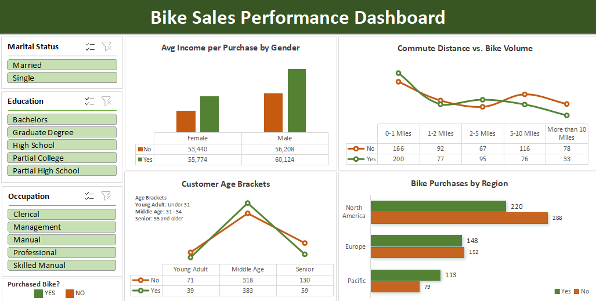

# 🚲 Bike Sales Performance Analysis

## 🔎 Description
- This is an end-to-end data analysis project focused on identifying the key demographics and consumer behaviors that drive bike purchases.

## 🛠 Tools Used
- Microsoft Excel was used for the entire project lifecycle, including data cleaning, processing, and visualization.

## 🗃️ Project Structure
- `data/` → xlsx file that contains the raw and cleaned dataset (`bike_sales_dataset.xlsx`)
- `data_cleaning_eda/` -> txt files with complete documentation of data cleaning and EDA processes.
  - `bike_sales_data_cleaning.txt`
  - `bike_sales_eda.txt`
-`visualization/` → screenshot of the Bike Sales Performance Dashboard
  - `Bike Sales Performance Dashboard Preview.png`
  - Note: The actual dashboard is saved in the same xlsx file from the data folder (`bike_sales_dataset.xlsx`).
- `README.md` → this file with project documentation
--

## 🧹 Data Cleaning (Excel)
**Key steps performed: **
1. Conducted initial Data Audit.
2. Data Preservation
3. Redundancy Removal
4. Data Transformation
   a. Standardizing Categorical Values
   b. Formatting Income
   c. Age Grouping

After cleaning:
- Raw records: 1,026
- Duplicates removed: 26
- Final cleaned dataset: 1000 
---

## 📊 Exploratory Data Analysis (EDA) 
**The analysis was structured into the following sections:**
1. Data Profiling
2. Income & Gender Analysis
3. Commute Distance vs. Bike Purchase Analysis
4. Age Demographic Analysis
5. Bike Purchases by Region
6. Key Insights Summary

### 💡Key Insights
- Customers who purchased a bike consistently show a higher average income compared to those who didn’t.
- In the given dataset, Male customers have higher average income than Female customers in both bike ‘purchaser’ and ‘non-purchaser’ categories.
- It is evident that customers with the shortest commute distances have the highest bike sales volume, suggesting bikes are primarily used for short-distance commuting rather than long-distance travel.
- Bike sales drop off significantly as commute distance increases, especially at the "More than 10 Miles" mark.
- The number of bike purchasers in this category is approximately half that of non-purchasers, indicating that most people in that demographic are not interested in the product, except perhaps for those who use it for exercise.
- The Middle Age demographic dominates bike purchases in the dataset. With 383 bike purchases, this group outperforms Young Adults by nearly 10x and Seniors by over 6x in total sales volume.
- North America accounts for over 50% of the total customer population, with nearly half (43%) of that segment purchasing a bike.
- While Europe and Pacific have lower total volumes, the Pacific region shows the highest engagement, with more bike purchasers (113) than non-purchasers (79). 
--

##  📈 Visualizations
- Excel was used to create the dashboard using built-in charts.

## 📌 Dataset Source
- Bike Sales dataset obtained from the Excel tutorial dataset by Alex The Analyst: (https://github.com/AlexTheAnalyst/Excel-Tutorial/blob/main/Excel%20Project%20Dataset.xlsx)
