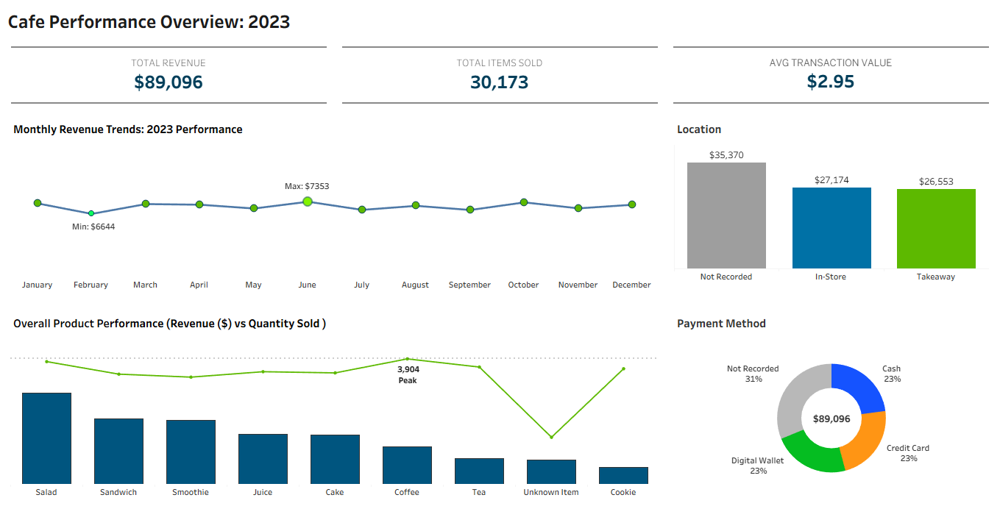

# ☕ Cafe Sales Analysis (2023 Dataset)

## 🧾 Description
- This project provides an end-to-end analysis of a 10,000-row cafe sales dataset from 2023. The analysis identifies key business drivers, including monthly revenue trends and sales volume fluctuations throughout the year.
---

## 🍴 Tools Used
- MS Excel
  - Data auditing and cleaning
  - Exploratory data analysis (EDA)
- Tableau
  - Visualization (Interactive dashboard)
---

## 🗃️ Project Strucure
- `data/` → raw dataset (csv file) and cleaned dataset (xlsx file)
  - `cafe_sales_dataset.csv`
  - `cafe_sales_dataset.xlsx`
- `data_cleaning_eda/` → documentation of data cleaning and EDA (txt files)
  - `cafe_sales_data_cleaning.txt`
  - `cafe_sales_eda.txt`
- `visualization`
  - `cafe_sales_visualization_tableau.twbx`
  - `dashboard_preview.png`
- `README.md` → this file with project documentation
---

## 🧹 Data Cleaning 
Please see `cafe_sales_data_cleaning.txt` from the `data_cleaning_eda` folder for full documentation

**Keys Steps Performed during Data Cleaning**
1. Data Overview
   - Check rows and columns
   - Identify missing data
   - Find any typo or inconsistencies with the data
   - Check data format

2. Backup Raw Data
   - Created a duplicate worksheet (working_sheet) to preserve the original raw dataset.
   - Ensures the raw data remains unchanged and allows safe experimentation during the cleaning process.

3. Remove Duplicates
   - Checked for duplicate records across all columns using Excel's Remove Duplicates feature -- No duplicate rows found.

4. Standardize Missing Values (Blanks, "UNKNOWN", "ERROR")
   - Missing or invalid data appeared in multiple formats.
   - Standardized all missing/invalid entries to blank cells.	
   - Ensures consistent handling of missing data during analysis and calculations.

5. Standardize Text and Formats
   - Applied TRIM and PROPER functions
   - Set appropriate number formats to ensure accurate calculations:
   - Applied Short Date format to Transaction Date

6. Handling Missing Data (Blank Values)
   - Price Per Unit Column
     - Identified 533 blank values in the Price Per Unit column.
     - Established Standard Prices using existing valid records.
     - Filled Missing Prices by Item
   - Quantity Column
     - Identified 479 blank values in the Quantity column.
     - Calculated the missing quantity values using available Price Per Unit and Total Spent data (456 rows).
   - Total Spent Column
     - Identified 502 blank values in the Total Spent column.
     - Calculated the missing Total Spent values using available Quantity and Price Per Unit data (479 rows):
   - Item Column
     - Identified 969 blank values in the Item column.
     - Item values were inferred when Price Per Unit uniquely identified an item.
     - Rows with ambiguous prices (3 and 4) were labeled as "Unknown Item".
   - Transaction Date Column
     - Identified 460 blank values in the Transaction Date Column.
     - Sorted Transaction ID and confirmed that it doesn't correlate with chronological order. 
     - Retained 460 records for categorical analysis (Item/Price/Location) but flagged them for exclusion from time-series visualizations to maintain historical accuracy.
   - Payment Method and Location Columns
     - Retained blank values in the Payment Method and Location columns rather than imputing "guessed" data.

7. Final Cleanup Steps
   - Delete rows with missing Total Spent and Price Per Unit (3 rows)
   - Impute Price Per Unit for rows with only Total Spent (Quantity assumed = 1)
   - Remove rows with Price Per Unit but missing both Quantity and Total Spent (20 rows)

## 🍵  Exploratory Data Analysis (EDA) and Key Insights
Please see `cafe_sales_eda.txt` from the `data_cleaning_eda` folder for full documentation

Phase 1: Data Profiling

1. Dataset Summary
   - Total Row Count: 9,977
   - Total Columns: 8
   - Primary Key Status: Transaction ID is 100% unique; no duplicate records were detected during the cleaning process.

2. Completeness of Data (Valid % | Empty %)
   - Transaction ID   : 100% |  0%
   - Item             : 100% |  0%
   - Quantity         : 100% |  0%
   - Price Per Unit   : 100% |  0%
   - Total Spent      : 100% |  0%
   - Payment Method   :  68% | 32%
   - Location         :  60% | 40%
   - Transaction Date :  95% |  5%

3. Data Integrity

   - Handling of Blank Values
      - To maintain the original integrity of the transaction records, missing values in the Payment Method and Location columns were 
        retained rather than imputed with estimated data.
   - Transaction ID Correlation
      - Transaction ID does not correlate with chronological order. Consequently, it was not used to infer missing dates.
   - Time-Series Analysis
      - Blank values in the Transaction Date column were retained for categorical analysis but were excluded from time-series visualizations 
        to maintain data accuracy.
   - Handling of Ambiguous Items
      - Items that could not be uniquely identified by price (e.g., $3.00 for Cake/Juice and $4.00 for Sandwich/Smoothie) were 
         labeled as "Unknown Item" to avoid misrepresenting product-specific sales trends.

4. Column Distribution (Frequency)
   - Top Items: Coffee (1,286) and Salad(1,270) are the highest frequency items.
   - Locations (In-Store vs. Takeaway) and Payment Methods (Cash, Credit Card, Digital Wallet) are nearly equally distributed among the recorded data.
   - 477 records are labeled as "Unknown Item." 

5. Column Profile (Statistical Range)	
   - Quantity: Ranges from 1 to 5 units per transaction.
   - Price Per Unit: 
      - Minimum: $1.00
      - Maximum: $25.00 (Identified as an outlier in "Unknown Items").
      - Note on the $25.00 Price: 
          - It only appears for records labeled as "Unknown Item". In these cases, the item name and Quantity were missing, but the Total Spent was available. 
	  - To preserve the accuracy of the total revenue in the dataset, it was assumed that  the transaction represented the purchase of one item with a price equal to the recorded Total Spent. This approach allows the dataset to maintain correct sales totals even though the specific item details  are unavailable. 
   - Total Spent: 
      - Ranges from $1.00 to $25.00.
      - Average Total Spent: $8.93	
   - Transaction Date
      - Date Range: January 2023 – December 2023 (95% coverage)

Phase 2: SALES & TREND EXPLORATION

1. Product Performance (Volume vs. Value)
   Action:
     - Created a pivot table to compare the total qty vs total spent for each product
     - Used bar and line charts for visualization.
   Insights:
     - Coffee is the most popular item by quantity (3,904 units), making up nearly 13% of all items sold.
     - Salad is the primary financial driver, contributing 21.43% ($19,095) of total revenue, despite being sold less often than Coffee.
     - This indicates that coffee is the hook that brings people in. While salad is what keeps the business running. 

2. Cafe Revenue Monthly Trends: 2023 Performance
   Action:
     - Created a pivot table to calculate the percentage share of annual revenue for each month.
     - Designed a time-series line chart with a zero-based Y-axis to accurately represent revenue stability.
     - Applied dynamic sizing and color-coding to highlight the Peak (June) and Minimum (February) performance points.
     - Implemented Window Calculations for dynamic Peak/Minimum labeling and utilized hidden reference lines to provide an aesthetic buffer for Y-axis scalability.
   Insights:
     - June was the best month of the year, bringing in 8.66% of total sales. This was likely driven by summer promos or seasonal drinks.
     - February shows the lowest total revenue, primarily because it has the fewest days. On a "per-day" basis, sales remained very steady.
     - Every month contributed about 8% to the yearly total. This shows a very consistent and loyal customer base throughout 2023.

3. Monthly Item Performance (Revenue)
   Action:
     - Created a pivot table to calculate the monthly share of each item in terms of revenue and volume sales. 
     - Used to determine the top selling items in the peak month (June)
   Insights:
     - Salad generates the highest share of total revenue (21.45%) despite selling fewer units (3,644) than Coffee (3,766).
     - Coffee is the most sold item by volume (3,766 units), but contributes a relatively small portion of revenue (8.87%).
     - In June, Salad contributes the largest portion of that month’s revenue (22.37%) and also records the highest unit sales (329 units) among all items.

4. KPI - Key Performance Indicator
   Action:
     - Used pivot table to calculate the total revenue, total quantity and average transaction value.
     - Created KPI cards to highlight them in the dashboard. 
   Insights:
     - Total Revenue: 89096
     - Total Items Sold: 30173
     - Average Transaction Value: $2.95 

5. Location Breakdown
   Action:
     - Created a pivot table to determine the group the location of all transactions
     - In the final dashboard, these are explicitly labeled as 'Not Recorded; to maintain transparency regarding data gaps.
   Insights:
     - A significant share of sales ($35,370) has no recorded location, which may affect location-based analysis.
     - In-store and takeaway sales are nearly equal, showing balanced customer behavior.

6. Payment Method Breakdown
    Action:
     - Created a pivot table to determine the group the payment method used for all transactions
     - In the final dashboard, these are explicitly labeled as 'Not Recorded; to maintain transparency regarding data gaps.
    Insights:
      - A large portion of transactions (31%) have missing payment method data, suggesting a data quality issue.
        
##  📈 Visualizations
### [🔗 Live Interactive Dashboard](https://public.tableau.com/views/GlobalLayoffsAnalysis2020-2026/Dashboard?:language=en-US&:sid=&:redirect=auth&:display_count=n&:origin=viz_share_link)

---

## 📌 Dataset Source
- Dataset obtained from: [Kaggle: Cafe Sales](https://www.kaggle.com/datasets/ahmedmohamed2003/cafe-sales-dirty-data-for-cleaning-training
)
