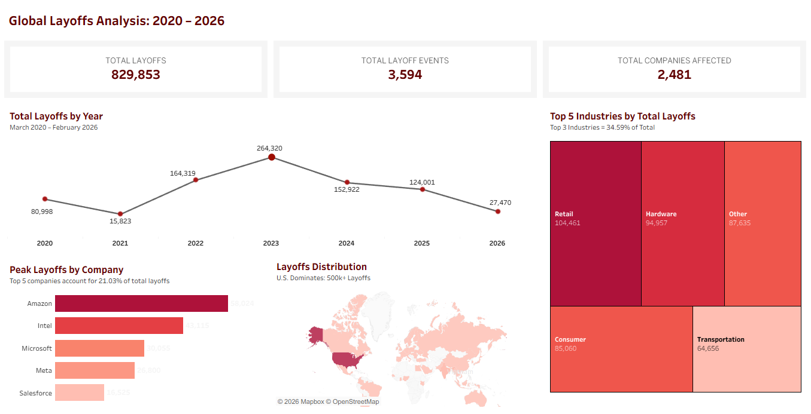

# 📉 World Layoffs Analysis

## 🔎 Description
- This project involves cleaning and analyzing a global layoffs dataset (2020–2026) using MySQL to perform structured exploratory data analysis (EDA). It identifies patterns in workforce reductions and economic cycles and includes a Tableau dashboard to visualize and interpret the results.
---

## 🛠 Tools Used
- MySQL (CTEs, Window Functions, Aggregations)
- CSV Dataset
- Tableau
---

## 🗃️ Project Structure
- `data/` → raw and cleaned CSV files
  - `layoffs_raw.csv`
  - `layoffs_cleaned.csv`
- `sql/` → SQL scripts for data cleaning and exploratory analysis
  -  `layoffs_data_cleaning.sql`
  -  `layoffs_exploratory_data_analysis.sql`
- `visualizations/` → screenshots and Tableau Packaged Workbook (*.twbx)
  - `layoffs_visualization.twbx`
  - `dashboard_preview.png`
- `README.md` → this file with project documentation
---

## 🧹 Data Cleaning (SQL)

**Key steps performed in the SQL script:**
1. Created staging tables to preserve the raw data
2. Removed duplicate records
3. Standardized data by removing extra spaces, correcting inconsistencies, and fixing typos
4. Converted data types
5. Handled blank and NULL values
6. Saved the final cleaned dataset as `layoffs_cleaned.csv`

After cleaning:
- Raw records: 4,299
- Cleaned records: 3,594
- Removed: 705 records

> SQL script: 📝 `sql/layoffs_data_cleaning.sql`
---

## 📊 Exploratory Data Analysis (EDA)

**The analysis was structured into the following sections:**
1. Structure Overview
2. Time Coverage
3. Overall Impact
4. Company Analysis
5. Industry Analysis
6. Geographic Analysis
7. Stage & Funding Analysis
8. Extreme Cases
9. Trend Analysis
10. Key Insights Summary

### 💡Key Insights
- The dataset has 3,594 layoff events from 2,481 companies, covering 2020 to 2026. Total layoffs worldwide are 829,853.
- Most layoffs happened in the United States, especially in the SF Bay Area and Seattle.
- Retail, Hardware, and Consumer industries had the most layoffs.
- Big companies, especially Post-IPO and those with over $1B funding, had the largest layoffs.
- Some extreme cases show companies laying off 100% of their workforce, mostly in Healthcare, Retail, and Food.
- Yearly trend:
  - 2021: big drop in layoffs (-80%)
  - 2022: huge increase (+938%)
  - 2023: peak layoffs (264,320)
  - 2024–2026: layoffs gradually went down
- Overall pattern: layoffs spike in certain years and industries, then slowly decrease, showing a cycle.
--- 

##  📈 Visualizations

**I used Tableau to create a comprehensive dashboard that translates the SQL-cleaned data into actionable insights.**

### ✨ Interactive Features & Charts:

- Yearly Layoff Trends: A line chart identifying the significant 938% spike in 2022 and the 2023 peak of 264,320 layoffs.
- Global Distribution: A geographic map visualizing the United States as the primary epicenter of workforce reductions.
- Industry Impact: A treemap showcasing that the Top 3 industries (Retail, Hardware, and Other) account for 34.59% of total layoff volume.
- Company Volume: A horizontal bar chart ranking the top 5 most affected companies, led by major tech firms like Amazon and Intel.
### [🔗 Live Interactive Dashboard](https://public.tableau.com/views/GlobalLayoffsAnalysis2020-2026/DLayoffsOverview?:language=en-US&:sid=&:redirect=auth&:display_count=n&:origin=viz_share_link)

---

## 📌 Dataset Source
- Global layoffs dataset obtained from: [Kaggle: Layoffs 2022](https://www.kaggle.com/datasets/swaptr/layoffs-2022)
